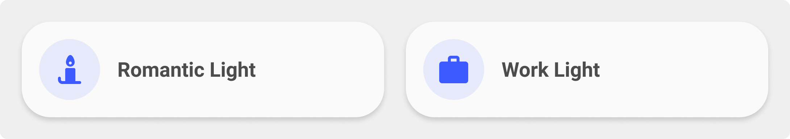

<!-- markdownlint-disable MD046 -->

!!! info "Editable card port"
    This card is now available as a UI-editable Lovelace card:

    ```yaml
    type: custom:ulm-script-card
    ```

    Configure it from the Home Assistant card picker (**ULM ...**). See `editable-cards/README.md`.


## Description

{ width="500" }

This card starts/runs a script. You can configure icon and text.

## Variables

| Variable                | Default | Required         | Notes                                                                                           |
|-------------------------|---------|------------------|-------------------------------------------------------------------------------------------------|
| ulm_card_script_title   |         | :material-check: | Name to show for the script.                                                                    |
| _card_script_icon       |         | :material-check: | Icon to show for the script.                                                                    |
| tap_action_action       |         | :material-check: | Only call-service is allowed here.                                                              |
| tap_action_service      |         | :material-check: | Let the script run by turning it on.                                                            |
| tap_action_service_data |         | :material-check: | This is the service_data needed by your script. That can be an entity_id and/or some variables. |

## Usage

```yaml
- type: "custom:ulm-script-card"
  entity: script.romantic_livingroom_lights
  name: Romantic lights
  icon: mdi:candle
```

??? note "Template Code"

    ```yaml title="card_script.yaml"
    --8<-- "custom_components/ui_lovelace_minimalist/lovelace/ulm_templates/card_templates/cards/card_script.yaml"
    ```
